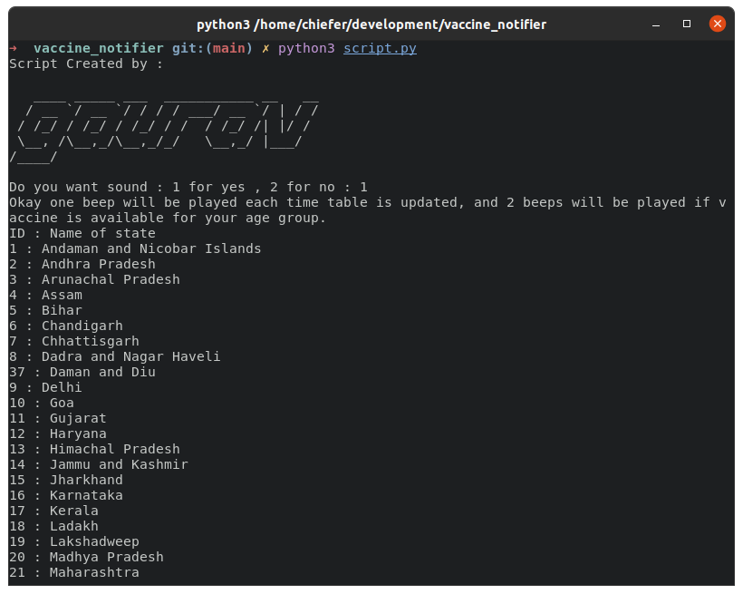
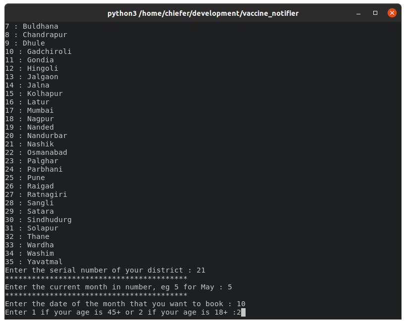
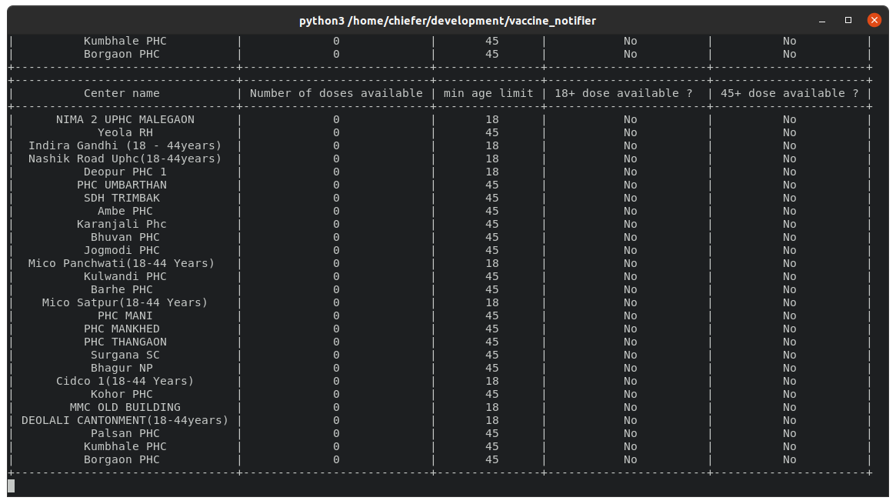
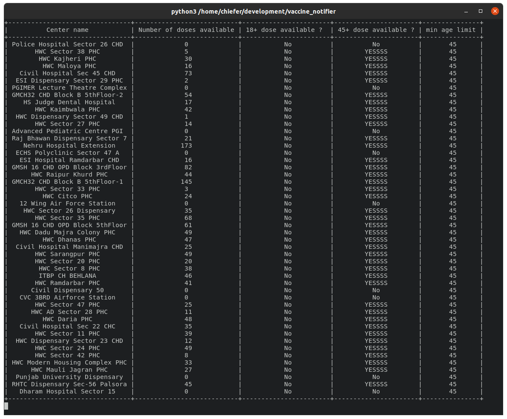

# vaccine_notifier
A python script that will keep running and notify you whenever new vaccine is available near you.

Watch the demo on youtube by clicking [here](https://youtu.be/DPzjwUqFPZo)

Requirements : python3, pip3
pip3 packages required :pyfiglet, requests, prettytable, playsound

You can install above requirements manually or use the install_requirements.sh script for Debian systems by executing
```
$ bash install_requirements.sh
```
To run the progrma from terminal just run the script.py file
```
$ python3 script.py
```

The program will display a list of states, then you have to choose your state. After that it will display the district and you have to choose your respective district. Then you have to enter the month, date and your age group.
Now the program will continuously display the list of centers in your district and  the availability for the vaccine for your age group. You are also provided an option for beeps which will notify you the availability of the vaccine.

<br><br>
<br><br>
<br><br>
<br><br>
